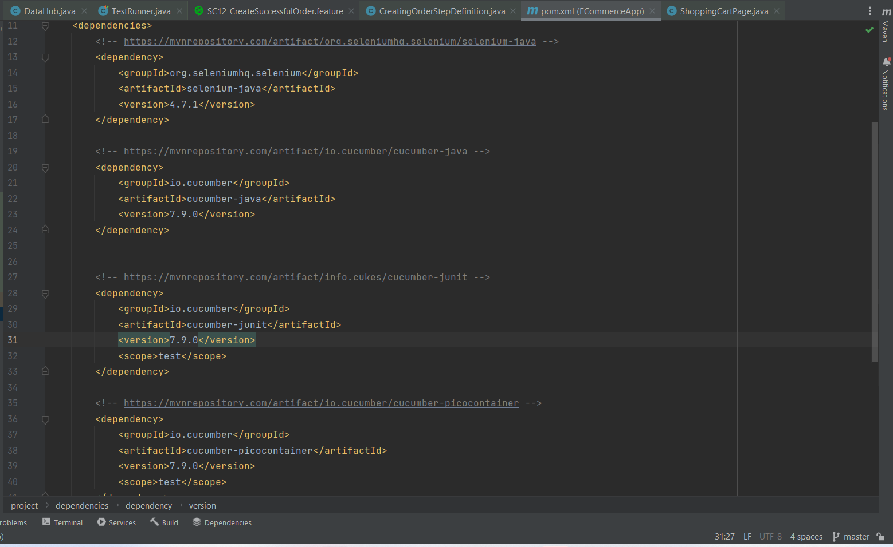
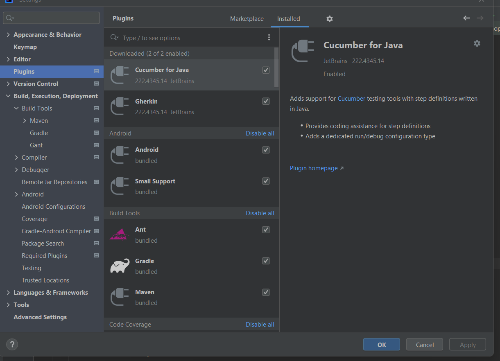

# Screenshots

## Dependencies

## Plugins

## Run

## Useful Resources
* [What are Cucumber Hooks And How to Use Cucumber Hooks in Java](https://www.toolsqa.com/cucumber/cucumber-hooks/)
* [SLF4J: 10 Reasons Why You Should Be Using It](https://stackify.com/slf4j-java/)
* [Official Cucumber.js Pretty Formatter - GitHub](https://github.com/cucumber/cucumber-js-pretty-formatter)
* Visualize the reports and create a graphical report. One of such tools is: [Allure Framework](https://docs.qameta.io/allure/)
